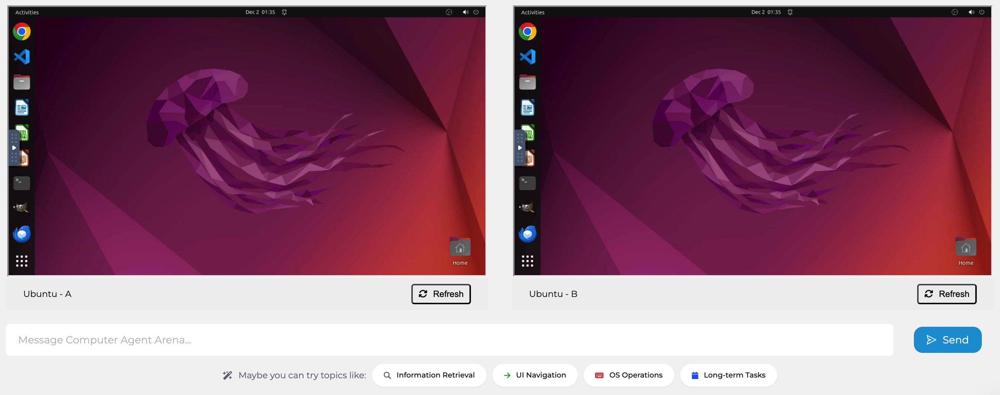

<p align="center">
    
</p>

<p align="center">
  <a href="https://arena.xlang.ai">Website</a> •
  <a href="#">Blog (Coming Soon)</a> •
  <a href="#">Paper (Coming Soon)</a> •
  <a href="https://xlang-ai.github.io/computer-agent-arena">Documentation</a> •
  <a href="CONTRIBUTING.md">Contributing</a>
</p>

<p align="center">
    <a href="LICENSE">
        
    </a>
    <a href="https://www.python.org/downloads/">
        
    </a>
    <a href="CONTRIBUTING.md">
        
    </a>
    <br/>
</p>

<p align="center">
    
</p>

## 📢 Updates
- 2024-12-02: Initial beta-release of [Computer Agent Arena](https://arena.xlang.ai) platform 🥳, Try it out!

## 📖 Overview
The [Computer Agent Arena](https://arena.xlang.ai) is an open-ended evaluation platform designed for benchmarking LLMs/VLMs-based AI agents in real-world computer tasks across diverse domains, ranging from general desktop operations to specialized workflows, such as programming, data analysis, and multimedia editing.

This repository hosts the source code implementations for all supported agents on the platform, serving as a foundation to integrate and extend support for additional agents within the Computer Agent Arena ecosystem.

## 💾 Quick Start

### Installation
First, clone the repository:
```bash
# Clone the repository
git clone git@github.com:xlang-ai/Computer-Agent-Arena.git
cd Computer-Agent-Arena

# Install dependencies
pip install -r requirements.txt
```

Then, set up the environment variables by copying the example file and filling in the missing information:
```bash
# Setup environment variables
cp .env.example .env

"""
OPENAI_API_KEY=[your OpenAI API key]
ANTHROPIC_API_KEY=[your Anthropic API key]
# more keys here...
"""
```

At last, you can test the implemented agents by running:
```bash
# Activate the virtual environment
source .venv/bin/activate

# Run the tests
python test/test_agents.py
```
Once the tests are passed, the environment is set up successfully!

### Implement Customized Agents

> 🤝 **Want to contribute?**  
> Check out our [Contributing Guide](CONTRIBUTING.md) to learn how you can plugin your agent to improve Computer Agent Arena!

### Test Customized Agents
Once you have implemented your agent, you can test it by running:
```bash
# Activate the virtual environment
source .venv/bin/activate

# Run the tests
python test/test_agents.py --agent [your_agent_name]
```
Once the tests are passed, your agent is ready to be plugged into Computer Agent Arena! After that, you can follow the [Contributing Guide](CONTRIBUTING.md) to submit your agent for review.

We really appreciate any contributions to improve Computer Agent Arena! If there are any questions, feel free to open an issue or contact us via [email](mailto:bryanwang.nlp@gmail.com).

## 📄 Citation

If you find this project useful, please consider citing our project:

```bibtex
@misc{ComputerAgentArena2024,
  title={Computer Agent Arena: Benchmarking VLM Agents for Computer Use in the Wild},
  url={https://arena.xlang.ai},
  year={2024}
}
```